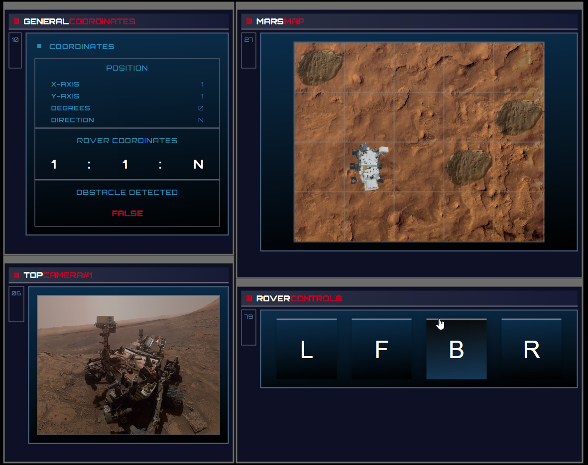

# Mars Rover Kata Web App

## Description

The Mars Rover Kata Web App is web application that simulates the movement of a rover across the Martian terrain. Users can navigate the rover and explore the 2D grid representing Mars, while handling movements and obstacle detection.

## Features

- **2D Grid Navigation:** A visual grid represents the Martian surface, allowing users to visualize the rover's position and obstacles.
- **Movement Controls:** Users can control the rover's movement (forward, backward, left, and right) across the grid.
- **Obstacle Detection:** The rover detects obstacles and informs the user, mapping the surface and preventing movement through them.
- **Dynamic Display:** The rover’s current coordinates, obstacles, and detection status are displayed dynamically.

## Technology

  
 
  
  

## Demo

To see a live demo of the Mars Rover Kata Web App, visit
[Demo](https://www.massidev.com/portfolio/mars-rover-kata/).

## Installation

To run the Mars Rover Kata Web App locally, follow these steps:

1. Clone the repository: `git clone https://github.com/massi-17/mars-rover-kata.git`
2. Navigate to the project directory: `cd mars-rover-kata`
3. Open the `index.html` file in your preferred web browser.

## Contributing

Contributions are welcome! If you want to contribute to this Mars Rover Kata Web App, please follow these steps:

1. Fork the repository.
2. Create a new branch: `git checkout -b feature/your-feature`.
3. Make your changes and commit them: `git commit -m 'Add your feature'`.
4. Push to the branch: `git push origin feature/your-feature`.
5. Submit a pull request.
